<div align="center">

# 🎵 Orpheus

**De Novo Transcriptome Assembly Quality Assessment Tool**  
**无参转录组组装转录本可信性评估工具**

[](https://www.python.org/downloads/)
[](LICENSE)
[](https://github.com/YanZezhang-debug/Orpheus)

[English](#english) | [中文](#中文)

---

</div>

## 中文

### 📖 简介

Orpheus 是一个专业的生物信息学流程整合工具，用于系统地评估无参转录组组装（de novo transcriptome assembly）的转录本质量。通过整合多个成熟的生物信息学软件和先进的评分算法，Orpheus 能够帮助研究者筛选出高可信度的转录本用于后续分析。

### ✨ 主要特性

- 🔬 **智能评分系统** - 综合 BUSCO 完整性、ORF 完整度、同源证据和序列长度的多维度评分
- 🧬 **同源证据整合** - 支持 Diamond/BLASTP 与蛋白质数据库比对，提高 ORF 预测准确性
- 📊 **完整度评估** - 自动识别完整 ORF（含起始和终止密码子），适用于 PCR 引物设计
- 🎯 **灵活的流程控制** - 支持从任意步骤开始执行，智能文件查找
- 📝 **详细报告** - 生成基因级别的整合报告，包含质量评分和功能注释
- ⚙️ **高度可配置** - YAML 配置文件，所有参数可灵活调整
- 🚀 **高性能** - 多线程支持，优化的数据处理流程

### 🔄 工作流程

```mermaid
graph LR
    A[Trinity Assembly] --> B[CD-HIT<br/>去冗余]
    B --> C[TransDecoder<br/>ORF 预测]
    C --> D[同源搜索<br/>Diamond/BLASTP]
    D --> E[BUSCO<br/>完整性评估]
    E --> F[综合评分<br/>转录本筛选]
    F --> G[高质量转录本]
```



### 📦 安装

#### 前置要求

**Python 环境：**
```bash
Python >= 3.7
PyYAML >= 5.4.1
```

**外部工具（需在 Linux 上安装）：**

```bash
# 使用 conda 安装（推荐）
conda install -c bioconda cd-hit transdecoder diamond busco

# 或使用包管理器
apt-get install cd-hit  # Ubuntu/Debian
```

#### 快速安装

```bash
# 克隆仓库
git clone https://github.com/YanZezhang-debug/Orpheus.git
cd Orpheus

# 安装 Python 依赖
pip install -r requirements.txt

# 安装 Orpheus
pip install -e .
```

#### 准备蛋白质数据库（可选但推荐）

```bash
# 下载 SwissProt 数据库
wget https://ftp.uniprot.org/pub/databases/uniprot/current_release/knowledgebase/complete/uniprot_sprot.fasta.gz
gunzip uniprot_sprot.fasta.gz

# 构建 Diamond 数据库
diamond makedb --in uniprot_sprot.fasta --db swissprot_db
```

### 🚀 快速开始

#### 基本用法

```bash
# 查看帮助
orpheus -h

# 运行完整流程
orpheus -i trinity_assembly.fasta

# 使用自定义配置
orpheus -i trinity_assembly.fasta -c my_config.yaml

# 指定线程数
orpheus -i trinity_assembly.fasta -t 32
```

#### 从特定步骤开始

```bash
# 从 TransDecoder 开始（自动查找中间文件）
orpheus --start-from transdecoder

# 直接运行评分步骤
orpheus --start-from busco_scoring
```

可用步骤：
- `beginning` - 从头开始（默认）
- `cdhit` - CD-HIT 去冗余
- `transdecoder` - ORF 预测
- `busco_scoring` - 评分和筛选

### 📊 评分系统

Orpheus 使用加权综合评分系统评估转录本质量：

```python
总分 = BUSCO分(40%) + 完整度分(30%) + 同源分(20%) + 长度分(10%)
```

**BUSCO 状态评分：**
- Complete: 1.0
- Duplicated: 0.9
- Fragmented: 0.5
- Missing: 0.0

**ORF 完整度评分：**
- Complete（含起始/终止密码子）: 1.0
- Partial: 0.3-0.7
- Internal: 0.0

**同源证据：**
- 有匹配: 1.0
- 无匹配: 0.0

### 📁 输出文件

```
orpheus_output/
├── cdhit_result.fasta              # CD-HIT 去冗余结果
├── transdecoder_results/           # TransDecoder 输出
│   ├── *.transdecoder.pep         # 预测的蛋白序列
│   ├── *.transdecoder.cds         # 预测的 CDS 序列
│   └── *.transdecoder.gff3        # GFF3 注释（含完整度信息）
├── integrated_report.tsv           # 整合报告（推荐查看）⭐
├── transcript_scores.tsv           # 详细评分表
├── high_confidence_transcripts.fasta  # 高质量转录本
└── orpheus.log                     # 运行日志
```

**整合报告示例：**

| gene_id | transcript_count | best_score | busco_status | busco_gene | orf1_type | orf1_length | homology_protein | homology_similarity |
|---------|------------------|------------|--------------|------------|-----------|-------------|------------------|---------------------|
| TRINITY_DN100_c0_g1 | 3 | 0.95 | Complete | BUSCO:12345 | complete | 1200 | sp\|P12345\|PROT_HUMAN | 95.2% |
| TRINITY_DN200_c0_g1 | 1 | 0.72 | Fragmented | BUSCO:67890 | 5prime_partial | 850 | - | - |

### ⚙️ 配置示例

```yaml
# config/default.yaml

cdhit:
  identity: 0.95        # 序列相似度阈值
  coverage: 0.9         # 覆盖度阈值
  threads: 8            # 线程数

transdecoder:
  min_protein_length: 100
  homology_search:
    enabled: true
    tool: "diamond"     # 或 "blastp"
    database: "/path/to/swissprot_db.dmnd"
    use_complete_only: true  # 仅使用完整 ORF

scoring:
  weights:
    busco: 0.4          # BUSCO 权重
    completeness: 0.3   # 完整度权重
    homology: 0.2       # 同源权重
    length: 0.1         # 长度权重
```

### 📚 文档

- 📖 [快速参考手册](docs/QUICK_REFERENCE.md)
- 🔄 [流程详细说明](docs/PIPELINE_FLOW.md)
- 🔬 [同源搜索配置](docs/HOMOLOGY_SEARCH.md)
- 🎯 [转录本评分系统](docs/TRANSCRIPT_SCORING.md)
- ⚙️ [配置文件示例](example_config.yaml)

### 🔖 版本历史

#### v0.2.0-dev (2025-11-05)

**新功能：**
- ✨ 整合报告生成 - 基因级别的综合信息视图
- ✨ BUSCO 评分系统 - Fragmented 基因获得合理的中等分数
- ✨ 智能文件查找 - 自动查找工作目录中的中间文件

**Bug 修复：**
- 🐛 修复 BUSCO full_table.tsv 深层目录查找问题
- 🐛 修复 Fragmented BUSCO 基因评分为 0 的问题

### 🤝 贡献

欢迎提交 Issue 和 Pull Request！

### 📄 许可证

本项目采用 [MIT License](LICENSE) 开源协议。

### 👤 作者

**Zhang Yanze**
- GitHub: [@YanZezhang-debug](https://github.com/YanZezhang-debug)
- Email: maimang0528@163.com

### 🙏 致谢

本项目整合了以下优秀的生物信息学工具：
- [CD-HIT](https://github.com/weizhongli/cdhit) - 序列聚类
- [TransDecoder](https://github.com/TransDecoder/TransDecoder) - ORF 预测
- [Diamond](https://github.com/bbuchfink/diamond) - 高速序列比对
- [BUSCO](https://busco.ezlab.org/) - 基因组完整性评估

---

## English

### 📖 Overview

Orpheus is a comprehensive bioinformatics pipeline integration tool designed to systematically assess the quality of de novo transcriptome assemblies. By integrating multiple mature bioinformatics tools and advanced scoring algorithms, Orpheus helps researchers identify high-confidence transcripts for downstream analysis.

### ✨ Key Features

- 🔬 **Intelligent Scoring System** - Multi-dimensional scoring based on BUSCO completeness, ORF integrity, homology evidence, and sequence length
- 🧬 **Homology Evidence Integration** - Supports Diamond/BLASTP protein database alignment for improved ORF prediction accuracy
- 📊 **Completeness Assessment** - Automatically identifies complete ORFs (with start and stop codons), suitable for PCR primer design
- 🎯 **Flexible Workflow Control** - Start from any step with intelligent file discovery
- 📝 **Detailed Reports** - Generate gene-level integrated reports with quality scores and functional annotations
- ⚙️ **Highly Configurable** - YAML configuration file with flexible parameter adjustment
- 🚀 **High Performance** - Multi-threading support with optimized data processing

### 🔄 Workflow


### 📦 Installation

#### Prerequisites

**Python Environment:**
```bash
Python >= 3.7
PyYAML >= 5.4.1
```

**External Tools (install on Linux):**

```bash
# Install using conda (recommended)
conda install -c bioconda cd-hit transdecoder diamond busco

# Or use package manager
apt-get install cd-hit  # Ubuntu/Debian
```

#### Quick Install

```bash
# Clone repository
git clone https://github.com/YanZezhang-debug/Orpheus.git
cd Orpheus

# Install Python dependencies
pip install -r requirements.txt

# Install Orpheus
pip install -e .
```

#### Prepare Protein Database (Optional but Recommended)

```bash
# Download SwissProt database
wget https://ftp.uniprot.org/pub/databases/uniprot/current_release/knowledgebase/complete/uniprot_sprot.fasta.gz
gunzip uniprot_sprot.fasta.gz

# Build Diamond database
diamond makedb --in uniprot_sprot.fasta --db swissprot_db
```

### 🚀 Quick Start

#### Basic Usage

```bash
# Show help
orpheus -h

# Run complete pipeline
orpheus -i trinity_assembly.fasta

# Use custom configuration
orpheus -i trinity_assembly.fasta -c my_config.yaml

# Specify thread count
orpheus -i trinity_assembly.fasta -t 32
```

#### Start from Specific Step

```bash
# Start from TransDecoder (auto-find intermediate files)
orpheus --start-from transdecoder

# Run scoring step directly
orpheus --start-from busco_scoring
```

Available steps:
- `beginning` - Start from scratch (default)
- `cdhit` - CD-HIT redundancy removal
- `transdecoder` - ORF prediction
- `busco_scoring` - Scoring and filtering

### 📊 Scoring System

Orpheus uses a weighted comprehensive scoring system to evaluate transcript quality:

```python
Total Score = BUSCO(40%) + Completeness(30%) + Homology(20%) + Length(10%)
```

**BUSCO Status Scores:**
- Complete: 1.0
- Duplicated: 0.9
- Fragmented: 0.5
- Missing: 0.0

**ORF Completeness Scores:**
- Complete (with start/stop codons): 1.0
- Partial: 0.3-0.7
- Internal: 0.0

**Homology Evidence:**
- With match: 1.0
- No match: 0.0

### 📁 Output Files

```
orpheus_output/
├── cdhit_result.fasta              # CD-HIT results
├── transdecoder_results/           # TransDecoder outputs
│   ├── *.transdecoder.pep         # Predicted protein sequences
│   ├── *.transdecoder.cds         # Predicted CDS sequences
│   └── *.transdecoder.gff3        # GFF3 annotation (with completeness info)
├── integrated_report.tsv           # Integrated report (recommended)⭐
├── transcript_scores.tsv           # Detailed scoring table
├── high_confidence_transcripts.fasta  # High-quality transcripts
└── orpheus.log                     # Run log
```

### ⚙️ Configuration Example

```yaml
# config/default.yaml

cdhit:
  identity: 0.95        # Sequence similarity threshold
  coverage: 0.9         # Coverage threshold
  threads: 8            # Thread count

transdecoder:
  min_protein_length: 100
  homology_search:
    enabled: true
    tool: "diamond"     # or "blastp"
    database: "/path/to/swissprot_db.dmnd"
    use_complete_only: true  # Use complete ORFs only

scoring:
  weights:
    busco: 0.4          # BUSCO weight
    completeness: 0.3   # Completeness weight
    homology: 0.2       # Homology weight
    length: 0.1         # Length weight
```

### 📚 Documentation

- 📖 [Quick Reference](docs/QUICK_REFERENCE.md)
- 🔄 [Pipeline Details](docs/PIPELINE_FLOW.md)
- 🔬 [Homology Search Configuration](docs/HOMOLOGY_SEARCH.md)
- 🎯 [Transcript Scoring System](docs/TRANSCRIPT_SCORING.md)
- ⚙️ [Configuration Examples](example_config.yaml)

### 🔖 Changelog

#### v0.2.0-dev (2025-11-05)

**New Features:**
- ✨ Integrated report generation - gene-level comprehensive information view
- ✨ BUSCO scoring system - Fragmented genes receive reasonable medium scores
- ✨ Intelligent file discovery - auto-find intermediate files in working directory

**Bug Fixes:**
- 🐛 Fixed BUSCO full_table.tsv deep directory search issue
- 🐛 Fixed Fragmented BUSCO gene scoring zero issue

### 🤝 Contributing

Issues and Pull Requests are welcome!

### 📄 License

This project is licensed under the [MIT License](LICENSE).

### 👤 Author

**Zhang Yanze**
- GitHub: [@YanZezhang-debug](https://github.com/YanZezhang-debug)
- Email: maimang0528@163.com

### 🙏 Acknowledgments

This project integrates the following excellent bioinformatics tools:
- [CD-HIT](https://github.com/weizhongli/cdhit) - Sequence clustering
- [TransDecoder](https://github.com/TransDecoder/TransDecoder) - ORF prediction
- [Diamond](https://github.com/bbuchfink/diamond) - High-speed sequence alignment
- [BUSCO](https://busco.ezlab.org/) - Genome completeness assessment

---

<div align="center">

**Made with ❤️ for the bioinformatics community**

If you find this tool useful, please consider giving it a ⭐!

</div>
